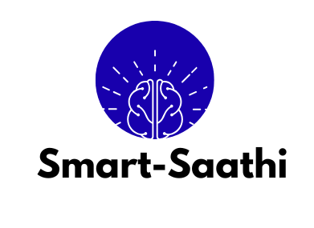

<h1 align="center">
  
  <br/>
  Smart-Saathi
</h1>

<p align="center">
  <strong>Free Quality Education for All · गुणवत्तापूर्ण शिक्षा सबके लिए</strong>
</p>

<p align="center">
  A gamified, offline-friendly educational frontend platform for underprivileged students in Grades 1–10 across India.
</p>

<p align="center">
  <a href="https://youtu.be/0tXCKE3RCcM" target="_blank">
    
  </a>
  &nbsp;
  
  &nbsp;
  
  &nbsp;
  
</p>

---

## 📖 About Smart-Saathi

Smart-Saathi is a **100% free** educational web platform built to bridge the digital divide in India. It delivers high-quality video lessons, interactive quizzes, scholarship discovery, and gamified learning — all optimised for students from economically weaker sections who may have limited internet access.

> *"Every child, regardless of their economic background, deserves access to excellent educational resources."*

### Key Highlights
- 🎓 Covers **Grades 1 – 10** across Mathematics, English, Science, and Social Studies
- 📹 **50+ curated video lessons** (YouTube-embedded, optimised for low bandwidth)
- 🧠 **Interactive quizzes** with instant feedback and scoring
- 🏆 **Gamification** — badges, points, and a live leaderboard
- 💰 **16+ Government scholarship listings** with eligibility, deadlines, and direct apply links
- 📄 Downloadable **Scholarship Guide PDF** and **User Manual**
- 📱 Fully **responsive** — works on phones, tablets, and desktops
- 🌐 **Hindi + English** bilingual interface

---

## ✨ Features

### 🏠 Landing Page
- Hero section with mission statement (Hindi + English)
- Feature cards: Free Lessons · Gamified Learning · Scholarship Info
- Platform stats: 10L+ Students · 50+ Videos · 15+ Scholarships
- Demo video link, Help access (pre-login), and Get Started CTA

### 🔐 Authentication
- **Sign In / Sign Up** modal with form validation
- Fields: Name, Age, Grade, Username, Password
- Demo client-side session authentication

### 📊 Dashboard
- Personalised welcome with student name and grade
- Progress stats: Lessons Completed, Overall Progress %, Badges Earned
- Achievement badges (First Lesson, Quiz Master, Week Warrior, Top Scorer)
- "Continue Learning" section with lesson progress bars

### 📚 Lessons
- Filter by **Grade (1–10)** and **Subject** (Mathematics, English, Science, Social Studies)
- Search bar for lesson discovery
- Each lesson card shows: thumbnail, duration, completion/download status
- In-app **YouTube video player** modal with lesson details

### 🧩 Quizzes
- Grade-wise, subject-tagged quizzes with difficulty levels (Easy / Medium / Hard)
- Timed quiz experience with instant right/wrong feedback
- Score display and best-score tracking

### 🏆 Leaderboard
- Weekly / Monthly / All-Time filters
- Grade-wise filtering
- Top 10 ranked students with badges and score
- Your current rank highlighted separately

### 💼 Scholarships
- **16 government scholarship listings** — NSP, INSPIRE MANAK, Kanyashree, NMMS, and more
- Filter by **Category** (Merit, Need-based, Minority, Girl Child, Sports & Arts) and **Grade Level**
- Each card shows: amount, provider, deadline, location, eligibility, requirements, required documents
- One-click **Apply Now** (opens official portal in new tab)
- Active/Closed status indicator
- **Download Scholarship Guide PDF** button

### ❓ Help & FAQ
- Category-wise FAQ: Getting Started, Technical Issues, Account & Profile, Learning Content
- Expandable accordion answers
- Available **pre-login** and post-login

---

## 🛠️ Tech Stack

| Layer | Technology |
|---|---|
| Framework | [React 18](https://react.dev/) |
| Build Tool | [Vite 5](https://vitejs.dev/) |
| Styling | [Tailwind CSS 3](https://tailwindcss.com/) |
| Icons | [Lucide React](https://lucide.dev/) |
| Language | JavaScript (JSX) |
| Linting | ESLint 9 + `eslint-plugin-react-hooks` |

> **Pure Frontend**: This repository contains the complete frontend application. All UI states, mock data, and interactions run entirely on the client side.

---

## 📂 Project Structure

```
Smart-Saathi/
├── public/
│   ├── smartsaathi.png     # App logo
│   ├── sess.jpg            # Hero background image
│   ├── Scholarship Guide.pdf
│   └── manual_guide.pdf
├── src/
│   ├── components/
│   │   ├── AuthModal.jsx   # Login / Sign-up modal
│   │   ├── Dashboard.jsx   # Student dashboard with stats & achievements
│   │   ├── Help.jsx        # FAQ & support page
│   │   ├── Layout.jsx      # Sidebar nav + header shell
│   │   ├── Leaderboard.jsx # Ranked student leaderboard
│   │   ├── Lessons.jsx     # Video lesson browser & player
│   │   ├── Quizzes.jsx     # Interactive quiz engine
│   │   └── Scholarships.jsx# Government scholarship listings
│   ├── App.jsx             # Root component & page router
│   ├── main.jsx            # React entry point
│   └── index.css           # Global styles
├── index.html
├── vite.config.ts
├── tailwind.config.js
├── package.json
└── README.md
```

---

## 🚀 Getting Started

### Prerequisites

- **Node.js** v18+ and **npm** v9+

### Installation

```bash
# 1. Clone the repository
git clone https://github.com/Vrajj24/Smart-Saathi.git
cd Smart-Saathi

# 2. Install dependencies
npm install

# 3. Start the development server
npm run dev
```

The app will be available at **http://localhost:5173** (or the next available port).

### Other Scripts

```bash
npm run build      # Production build → dist/
npm run preview    # Preview production build locally
npm run lint       # Run ESLint checks
```

---

## 📸 Screenshots

| Landing Page | Dashboard | Lessons |
|---|---|---|
| Hero section with mission, features & CTAs | Personalised stats, achievements, continue-learning | Grade/subject filtered video library |

| Quizzes | Leaderboard | Scholarships |
|---|---|---|
| Timed, graded MCQ engine | Weekly/monthly ranked board | 16 govt. schemes with apply links |

---

## 🗺️ Roadmap

- [ ] Offline mode with service workers (PWA)
- [ ] Hindi-language UI toggle
- [ ] Parent / Teacher dashboard view
- [ ] Push notifications for scholarship deadlines
- [ ] More languages (Gujarati, Marathi, Tamil, …)

---

## 📬 Links & Support

| Channel | Details |
|---|---|
| Demo Video | [YouTube](https://youtu.be/0tXCKE3RCcM) |
| Issues | [GitHub Issues](https://github.com/Vrajj24/Smart-Saathi/issues) |

---

<p align="center">
  Made with ❤️ to empower every student in India
</p>
